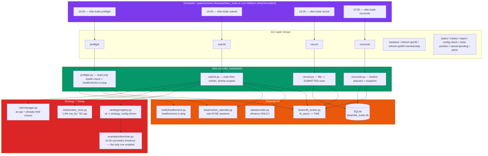
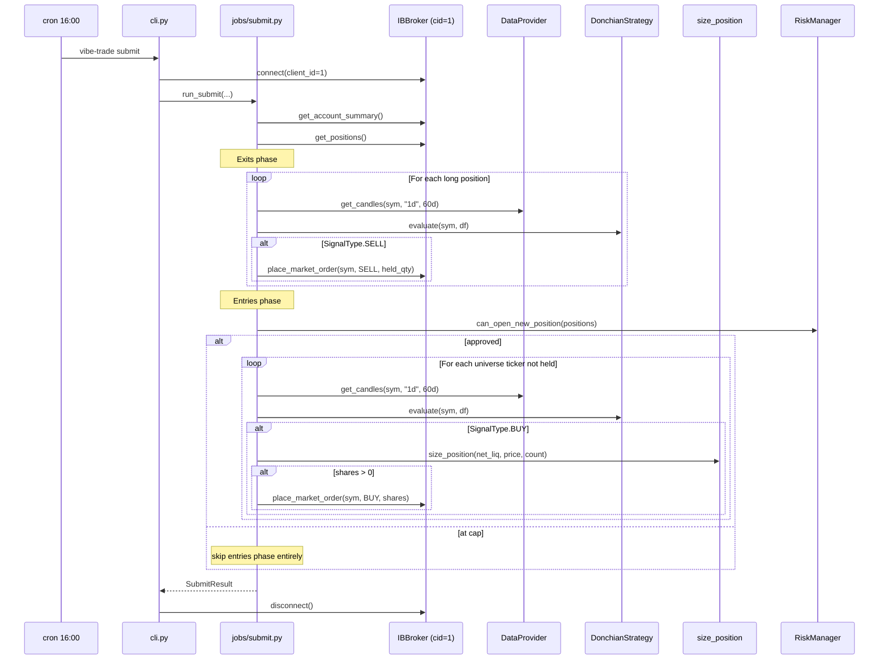
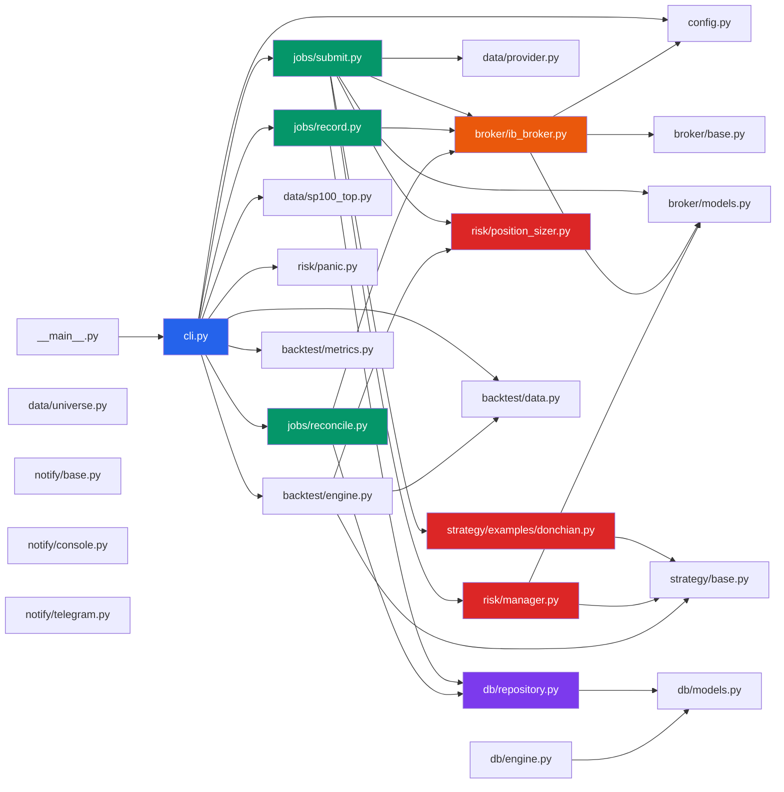
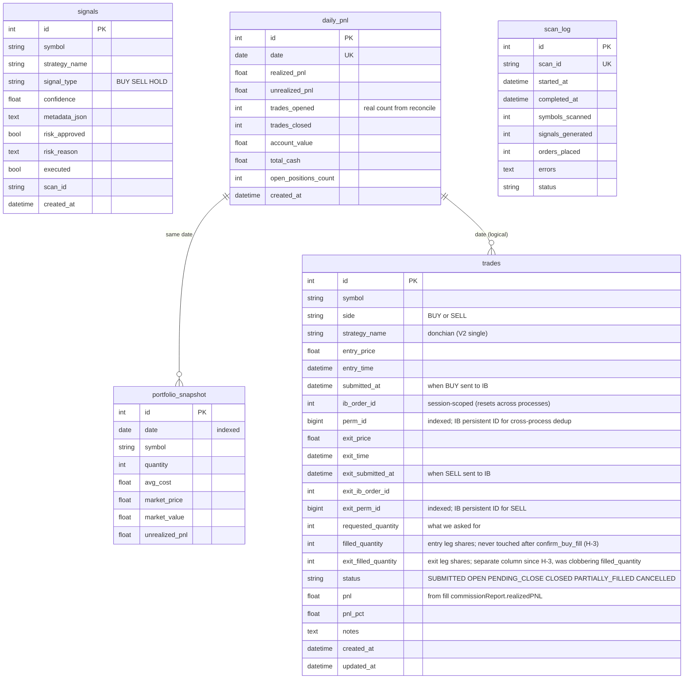

# Vibe Trade — Project Map (V2)

Use this file to understand what each module does, how they connect, and where to look when debugging.

V1 was deleted in Session E (commit `65dcbb9`). This document describes the V2 implementation as it stands.

---

## How The Bot Works (Big Picture)

Three OS-cron-triggered CLI jobs per trading day. Each is short-lived, does one thing, and exits.



---

## Daily Sequence (the contract)

```
Mon 15:50  vibe-trade preflight  (client_id=1)
           IB:  connectivity + account-mode check
           Ping: healthchecks.io (OPS-1) — READY or NOT READY, either way

Mon 16:00  vibe-trade submit  (client_id=1)
           IB:  read positions, place market orders
           DB:  no writes (V2 invariant)

Mon 16:35  vibe-trade record  (client_id=2)
           IB:  read ib.fills() — execution data with permId
           DB:  insert SUBMITTED rows (BUYs) /
                flip OPEN -> PENDING_CLOSE (SELLs)

Mon 16:30  US market opens — IB fills the market orders

Mon 23:00  US market closes

Mon 23:30  vibe-trade reconcile  (client_id=3)
           IB:  ib.fills() + ib.trades().orderStatus
           DB:  status transitions + portfolio_snapshot
                + daily_pnl with real counts

Tue 00:00  Idle until next 16:00
```

**Cross-process key fact:** between submit (16:00) and record (16:35), processes restart. `ib.trades()` returns the orders but `order.totalQuantity` and `orderId` are reset to 0. Only `permId` survives. Record + reconcile dedup on `permId` and pull quantities from `ib.fills()`. Verified live 2026-04-27.

---

## Submit Sequence



---

## Module Dependency Graph

Shows which modules import from which — what breaks if you change a file.



---

## Database ER Diagram



**Status lifecycle:**

```
BUY:   SUBMITTED -> OPEN              (full fill)
                 -> PARTIALLY_FILLED  (partial, no carry-over)
                 -> CANCELLED         (no fills + IB terminal)

SELL:  OPEN -> PENDING_CLOSE -> CLOSED            (full fill)
                             -> PARTIALLY_FILLED
                             -> reverts to OPEN   (cancel: position still held)
```

---

## File-by-File Reference

### Entry points

| File | Purpose |
|---|---|
| `pyproject.toml` | Deps + `vibe-trade` console script. |
| `src/vibe_trade/__main__.py` | Makes `python -m vibe_trade` work. |
| `src/vibe_trade/cli.py` | Typer commands: `preflight`, `submit`, `record`, `reconcile`, `report`, `report-weekly`, `backtest`, `refresh-sp100`, `refresh-sp500-membership`, `status`, `trades`, `config-check`, `close-position`, `cancel-pending`, `review-trades`, `panic`. |

### Config (`config.py`)

V2 config sections:

| Class | What |
|---|---|
| `AppConfig` | Top-level — wires up all sub-configs. |
| `GeneralConfig` | mode (paper/live), log level, db path |
| `BrokerConfig` | host, paper_port=7497, live_port=7496, client_id, retry/pacing |
| `UniverseConfig` | source ("sp500" or "custom"), custom_symbols |
| `SchedulerConfig` | retained as a section (interval/market hours) but not used by V2 jobs — a real scheduler (systemd timer or cron) drives the schedule. Kept dormant for future use. |
| `RiskConfig` | **V2 sizing fields:** `pct_per_position` (default 0.018), `max_open_positions` (default 50). |
| `TelegramConfig` | token, chat_id, notification flags — wired into submit/record/reconcile/panic/report-weekly (Session F). |
| `HealthcheckConfig` | **OPS-1 (2026-08-26):** `enabled`, `ping_url`, `timeout_seconds` — opt-in dead-man's-switch ping fired by `preflight` (READY or NOT READY). |
| `StrategyConfig` | **Reintroduced in Session L** (was removed in E, this is a different shape): `[[strategies]]` list — `id`, `enabled`, `params`, optional `pct_per_position`. List order = entry priority. |

Removed in Session E, still gone: `TrailingStopConfig`, `MACrossoverConfig`, `RSIMeanRevertConfig`.

### Jobs (`jobs/`)

| File | Function | Trigger |
|---|---|---|
| `jobs/preflight.py` | `run_preflight(broker, mode, ...)` — Gateway/config/universe/strategy health checks, read-only | 15:50 |
| `jobs/submit.py` | `run_submit(broker, strategies, data_provider, risk_manager, universe, position_owners, is_trading_day, ...)` | 16:00 |
| `jobs/record.py` | `run_record(broker, repo, now=None)` — reads `orderRef` → `strategy_name` | 16:35 |
| `jobs/reconcile.py` | `run_reconcile(broker, trade_repo, snap_repo, daily_repo, today=None)` | 23:30 |
| `jobs/override.py` | `run_close_position` / `run_cancel_pending` — manual, off-cycle, no DB writes | on demand |

Each is broker-injected for testability — tests pass `MockBroker`. Constants `SUBMIT_CLIENT_ID=1`, `RECORD_CLIENT_ID=2`, `RECONCILE_CLIENT_ID=3` live in `jobs/submit.py`; `OVERRIDE_CLIENT_ID=4`, notifier `client_id=8`.

### Broker (`broker/`)

| File | Purpose |
|---|---|
| `broker/base.py` | `BaseBroker` ABC: connect, disconnect, get_account_summary, get_positions, place_market_order, cancel_all_orders, get_open_orders, cancel_orders_for_symbol. |
| `broker/models.py` | Dataclasses: `AccountSummary`, `Position`, `OrderRequest`, `OrderResult`, `OpenOrder`. |
| `broker/ib_broker.py` | `IBBroker` — ib_async wrapper. Connects to TWS/Gateway. Paper=7497, Live=7496. `get_account_summary` resolves the real account id from `managedAccounts()` (fixed 2026-08-26 — used to resolve as the literal string `"All"`). |

### Data (`data/`)

| File | Purpose |
|---|---|
| `data/provider.py` | `DataProvider.get_candles` / `get_candles_batch` (bounded-concurrency, per-symbol timeout) via yfinance, async-friendly. |
| `data/universe.py` | `SP500_SYMBOLS` static list (~470 names — 7 delisted/acquired tickers purged 2026-08-26), used by submit and refresh-sp100. |
| `data/sp100_top.py` | Static top-100 by market cap snapshot. Generated by `vibe-trade refresh-sp100`. Backtest default universe. |
| `data/sp500_membership.py` | **New (C-2, 2026-08-26).** Point-in-time S&P 500 membership, generated by `vibe-trade refresh-sp500-membership`. Backtest `--universe sp500`. |
| `data/market_calendar.py` | **New (H-4, 2026-08-26).** Real NYSE sessions/holidays via `pandas_market_calendars` — gates preflight + submit on actual trading days, not a hand-maintained weekday check. |

### Strategy (`strategy/`)

| File | Purpose |
|---|---|
| `strategy/base.py` | `BaseStrategy` ABC + `SignalResult` dataclass + `SignalType` enum. Stateless — `evaluate(symbol, candles)`, no entry-price/stop awareness. |
| `strategy/registry.py` | **New (Session L).** `STRATEGY_FACTORIES` (id → factory) + `build_strategy`/`build_strategies`, driven by config `[[strategies]]`. |
| `strategy/examples/donchian.py` | N=20, symmetric, **excluding** the bar being evaluated. BUY close > prior 20-day high; SELL close < prior 20-day low. **The only strategy enabled in production.** |
| `strategy/examples/{sma,ema,macd}_crossover.py` | Regime/state crossovers (BUY fast>slow, SELL fast<slow). Registered, available, `enabled=false` by default — see the C-2 verdict in `PROJECT_MASTER_STATE.md` before enabling. |

### Risk (`risk/`)

| File | Purpose |
|---|---|
| `risk/manager.py` | `RiskManager.can_open_new_position(positions)` (cap check) + `can_trade_symbol(signal, positions)` (already-held check) + `select_force_trim_candidates`. |
| `risk/position_sizer.py` | `size_position(net_liq, price, current_position_count, pct=0.018, max=50) -> int`. Integer cents arithmetic to defeat float imprecision (`100_000 * 0.018` evaluates to `1799.999...`). Returns 0 to skip (cap reached / 1 share > target / non-positive inputs). |
| `risk/panic.py` | `panic_close_all()` — emergency exit-all. Used by `vibe-trade panic`. Test-covered as of the 2026-08-26 audit session (was zero-coverage). |

### Backtest (`backtest/`)

| File | Purpose |
|---|---|
| `backtest/data.py` | `fetch_and_cache_bars` (CSV per symbol) + `get_top_n_by_mcap`. yfinance fetcher injectable for offline tests. Cache dir: `data/historical/`. |
| `backtest/membership.py` | **New (C-2, 2026-08-26).** `MembershipTimeline`, `.at(date)`, `members_ever_in_range` — point-in-time S&P 500 membership, closes the survivorship-bias finding (C-2 in `PROJECT_EVALUATION.md`). |
| `backtest/engine.py` | `run_backtest(strategy, universe, start, end, membership=None, frictions=None, ...)` — day-by-day loop, reuses production strategy + `size_position`. Next-day-open fills. `Frictions` dataclass (slippage bps + IB commission model) — default zero, `--friction {median,stress}` for realistic costs. |
| `backtest/metrics.py` | `compute_metrics(result)` — Sharpe, max drawdown, CAGR, win rate, profit factor, avg holding, exposure. |

### Reports (`reports/`)

| File | Purpose |
|---|---|
| `reports/data.py` / `metrics.py` | Pure, read-only against `daily_pnl` + `portfolio_snapshot` + `trades`. No IB connection. Backs both `vibe-trade report` (terminal) and `report-weekly` (PNG). |
| `reports/render.py` | Terminal dashboard renderer (`vibe-trade report --days N`). |
| `reports/plot.py` | Weekly dashboard PNG (equity curve + holdings bar chart + key-metrics panel), mirrors `backtest/plot.py`. |

### DB (`db/`)

| File | Purpose |
|---|---|
| `db/engine.py` | `init_db(path)` creates SQLAlchemy engine + session factory + tables, then runs `migrations.run_migrations`. |
| `db/migrations.py` | **New (C-3, 2026-08-26).** `schema_version` singleton row + idempotent `ALTER TABLE`/`CREATE INDEX` steps — closes the "no migration path" finding; deliberately hand-rolled, not Alembic. |
| `db/models.py` | `Trade`, `Signal`, `DailyPnL`, `PortfolioSnapshot`, `SchemaVersion`, `ScanLog`. **`perm_id`/`exit_perm_id` indexed BigInteger** (cross-process dedup target). **`trades.exit_filled_quantity`** (new, H-3) — the exit leg's shares, kept separate from the entry-leg `filled_quantity` so a partial exit no longer clobbers the cost basis. |
| `db/repository.py` | Repos: `TradeRepository`, `SignalRepository`, `DailyPnLRepository`, `PortfolioSnapshotRepository`, `ScanLogRepository`. Key methods: `create_submitted_buy`, `mark_pending_close`, `confirm_buy_fill`, `confirm_close_fill`, `find_open_by_symbol` (FIFO — record's SELL matching now uses this, fixed C-4), `get_pending_orders` (no date filter, fixed for late-fill recovery). |

### Notify (`notify/`)

| File | Purpose |
|---|---|
| `notify/telegram.py` / `console.py` | Wired into submit/record/reconcile/panic/report-weekly (Session F). Console is the fallback when Telegram is disabled. |
| `notify/healthcheck.py` | **New (OPS-1, 2026-08-26).** `ping_healthcheck(url)` — stdlib `urllib` GET to a healthchecks.io-compatible URL, fired by `preflight`. |

### Scratches (`scratches/`)

Standalone scripts that hit live IB paper for shape discovery + DB writes. Not pytest. See `CLAUDE.md` for the list and one-liner descriptions.

---

## CLI Commands

| Command | Phase | Purpose |
|---|---|---|
| `vibe-trade preflight` | V2 daily | Gateway/config health check (15:50). Read-only. Pings healthchecks.io (OPS-1). |
| `vibe-trade submit` | V2 daily | Place market orders (16:00). No DB writes. |
| `vibe-trade record` | V2 daily | Persist today's fills (16:35). |
| `vibe-trade reconcile` | V2 daily | Finalize statuses + snapshot (23:30). |
| `vibe-trade report-weekly` | V2 weekly | Render + Telegram the dashboard PNG (Sat 09:00). |
| `vibe-trade backtest` | Validation | Simulate a registered strategy against historical data. `--universe {top100,sp500}`, `--strategy <id>`, `--friction {none,median,stress}`. |
| `vibe-trade refresh-sp100` | Maintenance | Regenerate top-100 by market cap (rewrites `data/sp100_top.py`). |
| `vibe-trade refresh-sp500-membership` | Maintenance | Regenerate point-in-time S&P 500 membership (rewrites `data/sp500_membership.py`). |
| `vibe-trade status` | Operator | Show open positions + today's P&L. |
| `vibe-trade trades` | Operator | List recent trades. |
| `vibe-trade report --days N` | Operator | Terminal performance dashboard. |
| `vibe-trade config-check` | Operator | Validate config + list active strategy pool. |
| `vibe-trade close-position SYMBOL` | Manual override | Market-close one ticker off-cycle. No DB write. |
| `vibe-trade cancel-pending [SYMBOL]` | Manual override | List working orders, or cancel one ticker's. |
| `vibe-trade review-trades` | Operator | List / resolve `NEEDS_REVIEW` rows. |
| `vibe-trade panic --yes` | Emergency | Close all positions + cancel orders. |

V1 commands `scan` and `start` were deleted in Session E.

---

## Status

- **545 tests passing** (full suite via `.venv/Scripts/python -m pytest`), `ruff check` clean
- Sessions A–E (V2 build), I (backtest framework), F (notifications), G (Docker), H (live paper week),
  J (manual override), K/K-plus (dashboards), L (multi-strategy registry) all merged on `main`
- **Live-trading since 2026-05-06.** A full five-agent audit (`PROJECT_EVALUATION.md`, 2026-08-26)
  found and fixed 4 CRITICAL + 5 HIGH issues the same day, plus rebuilt the backtest with a
  point-in-time universe, production settings, and real frictions (C-2). Verdict: `donchian` —
  the only strategy actually trading — trails SPY/QQQ buy-and-hold on every axis. That's a decision
  for the user, not a coding gap — see `PROJECT_MASTER_STATE.md` §7 and `docs/playbooks/go-live-criteria.md`.
- See `docs/ROADMAP.md` for what's next (Sessions F → onward) and `PROJECT_MASTER_STATE.md` for the live status

---

## Config Priority (highest wins)

1. Environment variables (`VIBE_TRADE_*`)
2. `.env` file
3. `config/config.toml`
4. Pydantic defaults in `config.py`

---

## Common Debug Tips

- **TWS connection fails:** check TWS is running on the right port (paper=7497, live=7496) and API is enabled (Edit → Global Configuration → API → Settings).
- **Backtest is slow on first run:** yfinance downloads 8 years × 100 symbols of daily bars (~5–10 min). Subsequent runs hit the CSV cache.
- **Cross-process orderId=0 issue:** if you're inspecting trades via a fresh client, only `permId` is reliable. Use `ib.fills()` for execution details.
- **DB inspection:** `data/vibe_trade.db` (production) or `data/test_paper.db` (scratches). Both are SQLite — open with DB Browser for SQLite, DBeaver, or `sqlite3` CLI.
- **Float-precision in sizing/metrics:** integer cents arithmetic in `position_sizer.size_position`; `pytest.approx` in metrics assertions.
