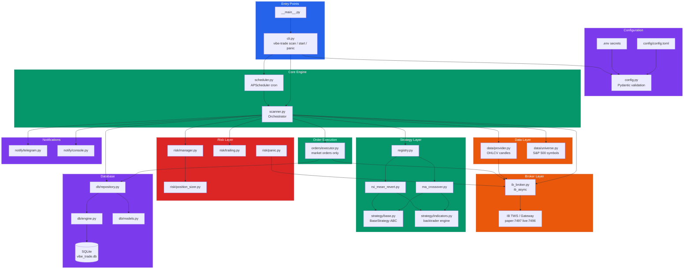
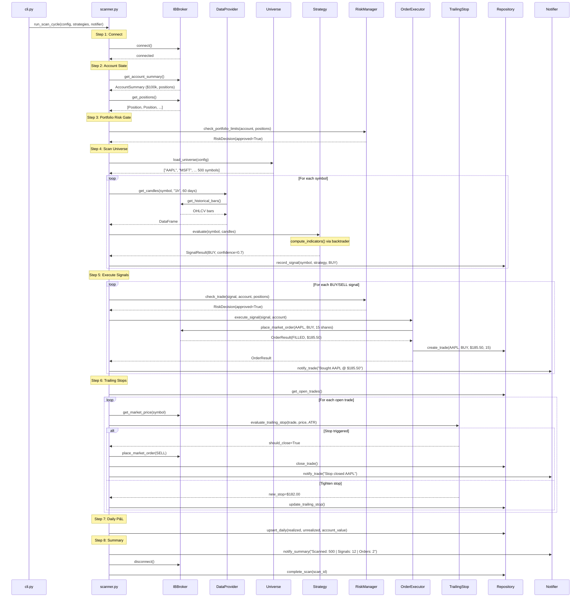
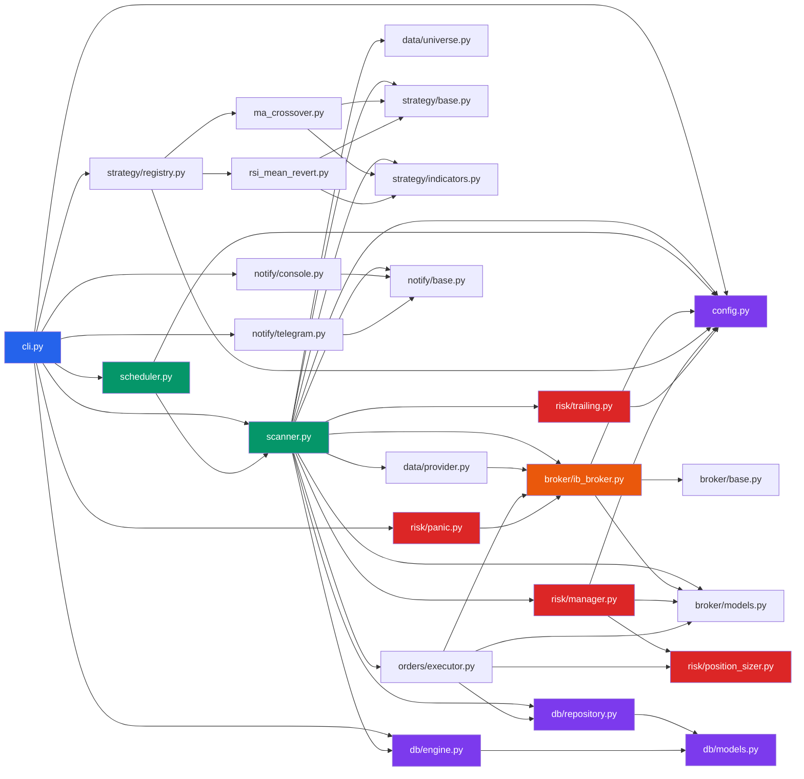
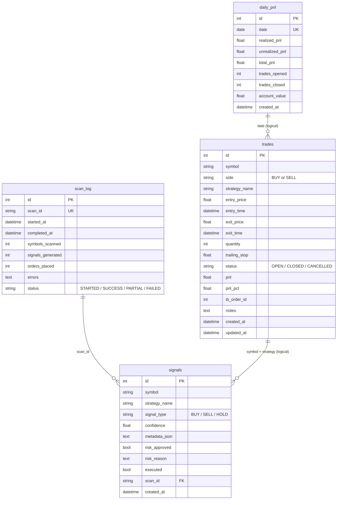
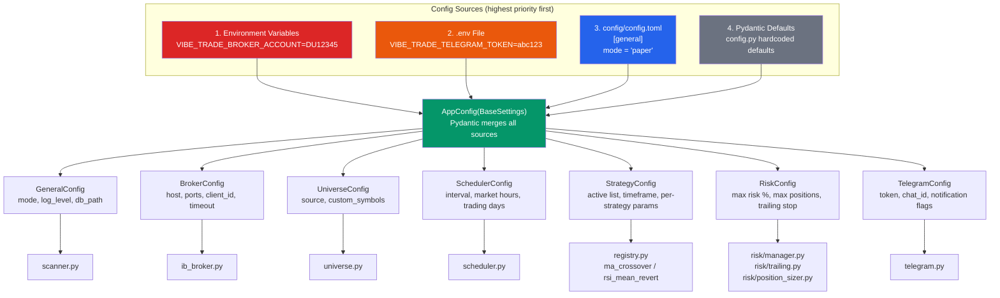

# Vibe Trade — Project Map

Use this file to understand what each file does, how they connect,
and where to look when debugging.

---

## How The Bot Works (Big Picture)

---

## Scan Cycle Sequence

This is the exact flow inside `run_scan_cycle()` — the heart of the bot:

---

## Module Dependency Graph

Shows which modules import from which — so you know what breaks if you change a file:

---

## Database ER Diagram

---

## Config Loading Flow

Shows how configuration is resolved — highest priority on top:

---

## File-by-File Reference

### Root Files

| File | What It Does |
|------|-------------|
| `pyproject.toml` | Project metadata, dependencies, CLI entry point (`vibe-trade` command). Build system is hatchling. |
| `.gitignore` | Excludes: .venv, __pycache__, .env, config.toml, *.db, logs/, data/ |
| `.env.example` | Template for secrets (Telegram token, IB account). Copy to `.env`. |
| `config/config.example.toml` | Full config template with all sections and comments. Copy to `config/config.toml`. |

### Entry Points

| File | What It Does |
|------|-------------|
| `src/vibe_trade/__init__.py` | Package version (`__version__ = "0.1.0"`). |
| `src/vibe_trade/__main__.py` | Makes `python -m vibe_trade` work. Just calls `cli.app()`. |

### Config (`config.py`)

**What:** Loads `config/config.toml` + `.env` file, validates everything with Pydantic.

**Key classes:**
- `AppConfig` — top-level, holds all config sections
- `GeneralConfig` — mode (paper/live), log level, db path
- `BrokerConfig` — IB host, ports, client ID. `get_port(mode)` returns 7497 or 7496
- `UniverseConfig` — "sp500" or "custom" symbol list
- `SchedulerConfig` — interval, market hours, timezone, trading days
- `StrategyConfig` — which strategies are active, timeframe, per-strategy params
- `RiskConfig` — max risk per trade, max positions, exposure limits, trailing stop settings
- `TelegramConfig` — bot token, chat ID, notification preferences

**Validation:** Rejects negative percentages, invalid timeframes, bad time formats, slow_period <= fast_period, overbought <= oversold.

**Debug tip:** Run `vibe-trade config-check` to validate your config.

### CLI (`cli.py`)

**What:** Typer-based command line interface. All user-facing commands live here.

**Commands:**
| Command | What It Does |
|---------|-------------|
| `vibe-trade scan` | Run one scan cycle (connect to IB, scan, trade, disconnect) |
| `vibe-trade start` | Start the scheduler (periodic scans during market hours) |
| `vibe-trade status` | Show open positions + today's P&L from the database |
| `vibe-trade trades` | Show recent trades table |
| `vibe-trade config-check` | Validate config file and show key settings |
| `vibe-trade panic --yes` | EMERGENCY: close ALL positions via market orders |

**Debug tip:** Each command loads config, sets up logging, and initializes the DB independently.

### Scanner (`scanner.py`)

**What:** The orchestrator — `run_scan_cycle()` is the heart of the entire bot. It connects all modules together into one atomic scan.

**Flow:** Connect -> Account state -> Risk gates -> Scan universe -> Execute signals -> Trailing stops -> Daily P&L -> Notify -> Disconnect

**Depends on:** broker, data, strategy, risk, orders, notify, db (everything)

**Debug tip:** Each symbol is scanned in a try/except so one failure doesn't kill the whole scan. Check `scan_log` table for error history.

**Known issue:** Signal ID wiring is incomplete (line 124, `signal_id=0`).

### Scheduler (`scheduler.py`)

**What:** APScheduler wrapper. Fires `run_scan_cycle()` at configured intervals during market hours.

**How:** Uses `BlockingScheduler` with `CronTrigger`. Converts trading days (mon/tue/etc) to cron day numbers. Each scan runs in its own `asyncio.run()` call.

**Debug tip:** If the scheduler seems to not fire, check timezone config and market hours. It only runs between `market_open` and `market_close` on `trading_days`.

---

### Broker Module (`broker/`)

| File | What It Does |
|------|-------------|
| `broker/base.py` | Abstract `BaseBroker` interface. All broker implementations must have: `connect()`, `disconnect()`, `get_account_summary()`, `get_positions()`, `place_market_order()`, `get_market_price()`, `cancel_all_orders()` |
| `broker/models.py` | Data classes: `AccountSummary` (account value, buying power, P&L), `Position` (symbol, qty, cost, market value), `OrderRequest` (symbol, side, qty), `OrderResult` (order ID, status, fill price) |
| `broker/ib_broker.py` | Interactive Brokers implementation using `ib_async` library. Connects to TWS/Gateway. Paper = port 7497, Live = port 7496. Also has `get_historical_bars()` for fetching OHLCV data. |

**Debug tip:** If connection fails, check that TWS/IB Gateway is running and API connections are enabled in TWS settings (Edit > Global Configuration > API > Settings).

**Debug tip:** `place_market_order()` waits up to 5 seconds (10 x 0.5s) for fill. If IB is slow, the order may show as "SUBMITTED" instead of "FILLED" — it's still working, just not confirmed yet.

### Data Module (`data/`)

| File | What It Does |
|------|-------------|
| `data/provider.py` | `DataProvider` — fetches OHLCV candles from IB via the broker, returns pandas DataFrames. Maps timeframes: "1h" -> "1 hour", "4h" -> "4 hours", "1d" -> "1 day". |
| `data/universe.py` | Loads stock list. "sp500" returns ~500 hardcoded S&P 500 tickers. "custom" reads from `config.universe.custom_symbols`. |

**Debug tip:** IB has rate limits on historical data requests (~6 requests per 2 seconds). With 500 S&P symbols, a full scan will take several minutes. No rate limiting is implemented yet.

**Debug tip:** `universe.py` has a hardcoded S&P 500 list. It will go stale as companies are added/removed. Consider updating periodically.

### Strategy Module (`strategy/`)

| File | What It Does |
|------|-------------|
| `strategy/base.py` | Abstract `BaseStrategy` class + `SignalResult` dataclass + `SignalType` enum (BUY/SELL/HOLD). Every strategy must implement `name`, `required_candles`, and `evaluate()`. |
| `strategy/indicators.py` | Technical indicators powered by backtrader. `compute_indicators()` runs all indicators in one pass. Also has convenience functions: `sma()`, `ema()`, `rsi()`, `atr()`, `macd()`, `bollinger_bands()`. Each convenience function runs a full backtrader Cerebro — for performance, use `compute_indicators()` when you need multiple indicators. |
| `strategy/registry.py` | Maps config names to strategy classes. `load_strategies()` reads `config.strategy.active` list, instantiates each with its config params. To add a new strategy: add it to `STRATEGY_MAP` and add config wiring. |
| `strategy/examples/ma_crossover.py` | Moving average crossover. BUY when fast SMA crosses above slow SMA and price > fast SMA. SELL when fast crosses below. Trailing stop set at `price - 2*ATR`. |
| `strategy/examples/rsi_mean_revert.py` | RSI mean reversion. BUY when RSI crosses back above oversold level. SELL when RSI crosses back below overbought level. Trailing stop set at `price - 2*ATR`. |

**Debug tip:** To add your own strategy:
1. Create a new file in `strategy/examples/`
2. Extend `BaseStrategy`, implement `name`, `required_candles`, `evaluate()`
3. Add it to `STRATEGY_MAP` in `registry.py`
4. Add config section in `config.py` and `config.example.toml`

### Risk Module (`risk/`)

| File | What It Does |
|------|-------------|
| `risk/manager.py` | `RiskManager` — two checks: `check_portfolio_limits()` (max positions, max exposure %) and `check_trade()` (already holding symbol? concentration too high?). Returns `RiskDecision(approved=True/False, reason="...")`. |
| `risk/position_sizer.py` | `calculate_position_size()` — formula: `shares = (account * risk_pct / 100) / abs(entry - stop)`. Floors to whole shares. Caps at account value. Returns 0 if invalid. |
| `risk/trailing.py` | `evaluate_trailing_stop()` — checks each open trade: if price <= stop, close it. If price went up, tighten stop (never loosen). Uses ATR-based or percentage-based method from config. |
| `risk/panic.py` | `panic_close_all()` — cancels all open orders, then sells every position via market orders. Used by `vibe-trade panic`. |

**Debug tip:** Position sizer returns 0 (skip trade) if entry == stop price or if the position would exceed account value. Check logs for "Position size is 0" messages.

### Orders Module (`orders/`)

| File | What It Does |
|------|-------------|
| `orders/executor.py` | `OrderExecutor` — takes a `SignalResult`, calculates position size, places a market order via the broker, records the trade in the database. For SELL signals, looks up the existing open trade for that symbol. |

**Debug tip:** If a BUY signal has no `trailing_stop_price` in the SignalResult, the executor will skip it and log an error.

### Notify Module (`notify/`)

| File | What It Does |
|------|-------------|
| `notify/base.py` | Abstract `BaseNotifier` — four methods: `notify_trade()`, `notify_summary()`, `notify_error()`, `notify_panic()`. |
| `notify/console.py` | `ConsoleNotifier` — logs to stdout via Python logging. Always available as fallback. |
| `notify/telegram.py` | `TelegramNotifier` — sends messages to Telegram chat via bot API. Token/chat_id from config or env vars. Respects `notify_on_trade`, `notify_on_error`, `daily_summary` config flags. |

**Debug tip:** If Telegram is enabled but token is empty, messages are silently skipped (logged as warning).

### Database Module (`db/`)

| File | What It Does |
|------|-------------|
| `db/engine.py` | Creates SQLAlchemy engine + session factory. `init_db()` creates all tables on first run. Uses SQLite at the path from `config.general.db_path`. |
| `db/models.py` | Four ORM tables: `trades` (open/closed positions), `signals` (every signal generated), `daily_pnl` (one row per day), `scan_log` (one row per scan cycle). |
| `db/repository.py` | CRUD classes: `TradeRepository` (create, close, update stop, list), `SignalRepository` (record, mark executed), `DailyPnLRepository` (upsert daily), `ScanLogRepository` (start, complete). |

**Tables:**
| Table | Key Columns | Purpose |
|-------|-------------|---------|
| `trades` | symbol, side, entry/exit price, quantity, trailing_stop, status, pnl | Track every trade open to close |
| `signals` | symbol, strategy, signal_type, confidence, risk_approved, scan_id | Log every signal from every scan |
| `daily_pnl` | date, realized/unrealized pnl, account_value | One row per trading day |
| `scan_log` | scan_id, started/completed_at, symbols_scanned, errors | Audit trail for each scan cycle |

**Debug tip:** Database file lives at `data/vibe_trade.db`. You can open it with any SQLite browser (DB Browser for SQLite, DBeaver, etc.) to inspect trades and signals.

---

## Known Issues & TODOs

| Issue | File | Line | Description |
|-------|------|------|-------------|
| TODO | `scanner.py` | 124 | `signal_id=0` — signal ID not wired up after recording |
| MISSING | - | - | No Dockerfile |
| MISSING | - | - | No retry logic for IB connection failures |
| MISSING | - | - | No IB rate limiting for historical data requests |
| MISSING | - | - | No graceful shutdown handling |
| MISSING | - | - | No market holiday calendar |

**Status:**
- 41 config tests passing (`pytest tests/`)
- Git repo initialized
- Both strategies use `compute_indicators()` correctly (fixed from initial draft)

---

## Config Priority (highest wins)

1. Environment variables (`VIBE_TRADE_*`)
2. `.env` file
3. `config/config.toml`
4. Pydantic defaults in `config.py`

See the [Config Loading Flow diagram](#config-loading-flow) above for the visual version.
